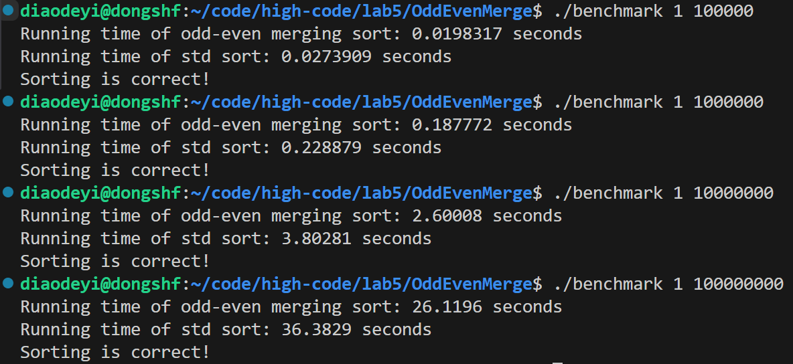
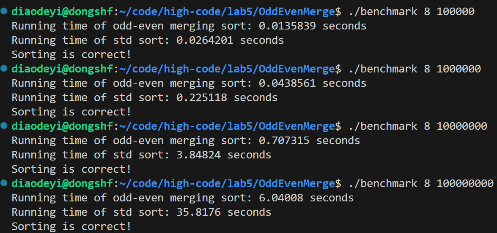
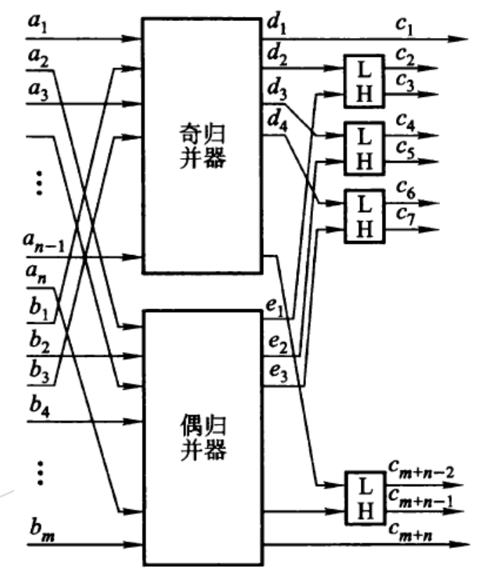
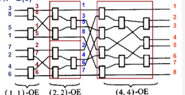

# Parallel-odd-even-merge-sort-network
基于Pthread和C++，在个人计算机实现核心受限制的并行奇偶归并排序网络，达到了近似线性并行加速比，和C++标准库的sort相比，具有明显的性能优势

## 效果展示

使用 Intel(R) Core(TM) Ultra 9 185H 运行




该项目实现的代码性能优势非常明显：

1、限制线程数为1，奇偶归并排序运行时间少于标准库sort

2、开启个人计算机最大线程数8，仍有很好的加速比

## 性能比较

由于并行奇偶归并排序网络一共需要进行$O(Nlog^2N)$次比较交换操作，而std::sort采用基于快速排序的算法，复杂度为$O(NlogN)$，从复杂度角度来讲达到线性加速比是不可能的。

在实际情况中是否能达到线性加速比还取决于：

（1）输入规模是否足够大；

（2）并行资源是否充足；

（3）实际硬件/通信开销；

（4）std::sort 是否在单线程下执行。

在某些实际情况下，即使复杂度稍高，只要能并行很好地展开，仍可能获得可观加速比（接近甚至超过线性）。

$$\text{加速比} = \frac{time_{std::sort}}{time_{OddEvenMerge}}$$
|线程数\数组规模|100000|1000000|10000000|100000000|
|:---:|:---:|:---:|:---:|:---:|
|1|1.38|1.22|1.46|1.39|
|2|1.58|2.24|2.37|2.76|
|4|2.11|3.65|4.00|5.26|
|8|1.94|5.13|5.44|5.93|

## 算法原理

说明：由于归并是一个基于分治策略的算法，该代码仅适用于输入规模n为2的次幂的情形。

但是，在n不是2的次幂情形下，可以手动将规模向上取到2的整数次幂，并且这样的操作由于负载更加均衡，对性能没有影响。

### 1、并行奇偶归并网络
见 "OddEvenMergingNet.hpp" 和 "OddEvenMergingNet.cpp"

定义奇偶归并网络功能：输入两个有序序列$(a_1, a_2, ..., a_n)$和$(b_1, b_2, ..., b_n)$，输出整体有序序列$(c_1, c_2, ..., c_{2n})$

具体实现思路如下：
奇数项序列$(a_1, a_3, ..., a_{n-1})$和$(b_1, b_3, ..., b_{n-1})$满足上面定义的奇偶归并网络输入要求，因此递归送入奇归并网络，偶数项序列同理，递归使用步长step来控制每次的奇数项和偶数项。

注意线程充足的情况下，奇偶归并网络可以并行。

奇偶归并器输出两个序列$(d_1, d_2, ..., d_n)$和$(e_1, e_2, ..., e_n)$，进行错位比较（如图所示）。

这里的编写代码的难点在于，$d_2$和$e_1$进行比较，但在前面的奇偶归并中，数组的顺序已经发生了改变，但是注意到经过奇偶归并后，$d_2$和$e_1$的位置只有可能是arr[start]和arr[start + step]，其他同理。




### 2、线程数受限的解决方案

以1中奇偶归并网络为例，第一次进入递归只有1个线程，可以并行进入下面的两次递归。

但是递归深度增加，线程数却不能无限增加，因此使用1中提到的step指示递归深度，每次进入递归首先检查step和thread_count的大小，如果深度足够，调用串行归并；否则创建新线程并行归并。

### 3、完整奇偶归并排序算法
由于输入规模 n 是 2 的整数次幂，因此可采用自底向上的分治策略：

首先将每两个元素排序为有序；

然后将每四个元素通过奇偶归并网络变成有序；

然后每八个，再每十六个，……直到整个数组归并排序完成。

两侧的分治可以并行，采用2中描述的并行策略



## 代码运行

### 比较std::sort和归并排序

编译并运行：
```cd Parallel-odd-even-merge-sort-network```
```./compile_run.sh```

仅运行：
```./run.sh```

### 排序输出可视化

```cd Parallel-odd-even-merge-sort-network```
```g++ -o test -lpthread test.cpp OddEvenMergingSort.cpp OddEvenMergingNet.cpp```
```./test```
